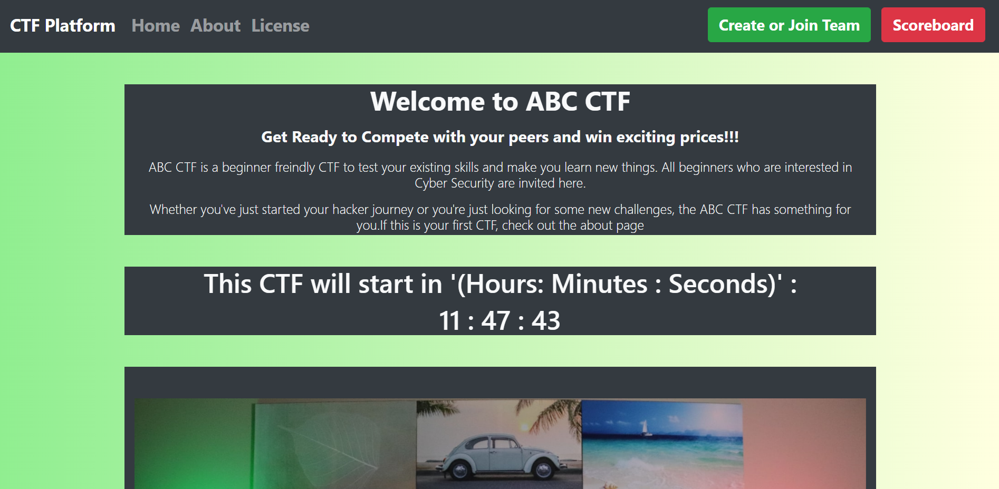
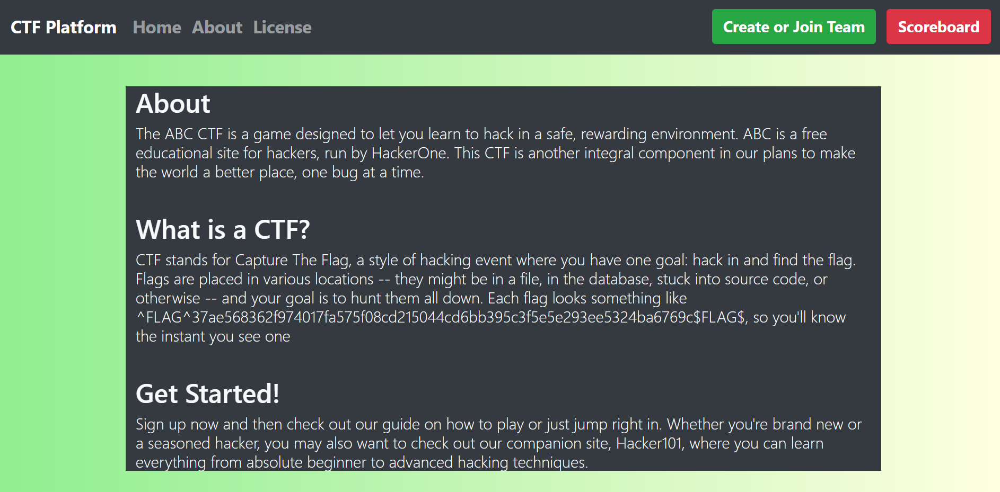
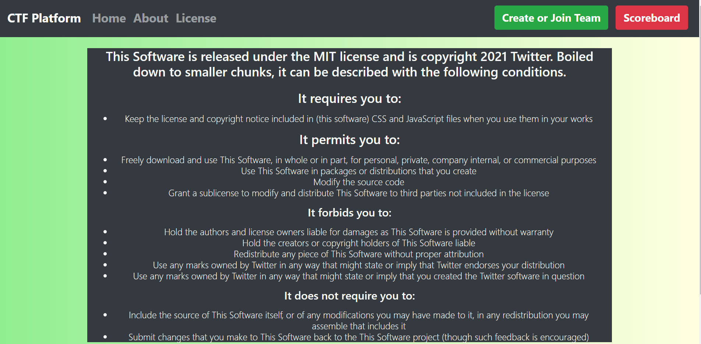
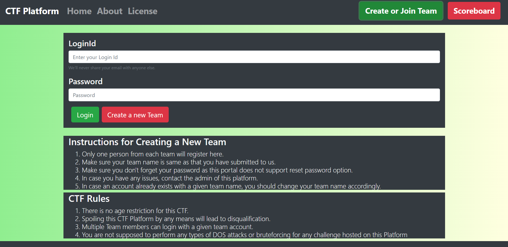
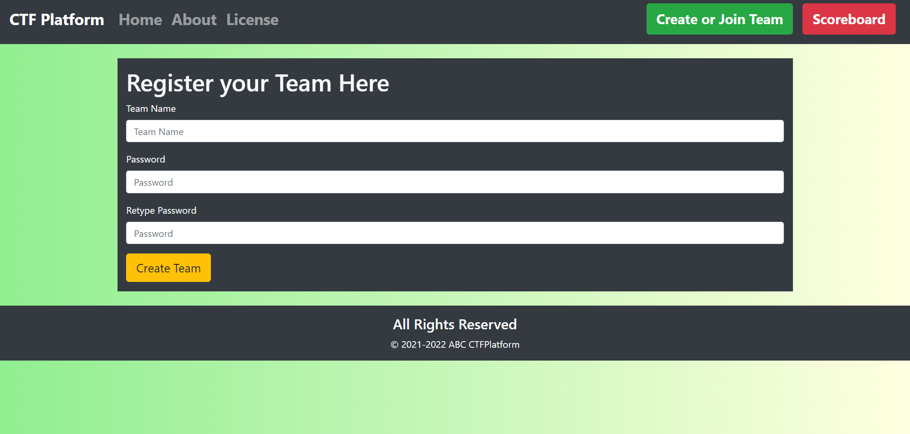
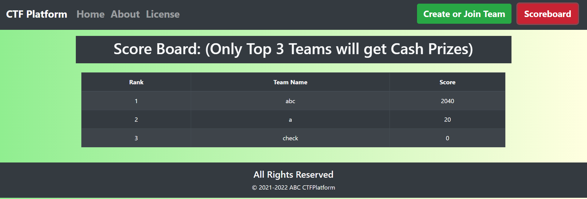
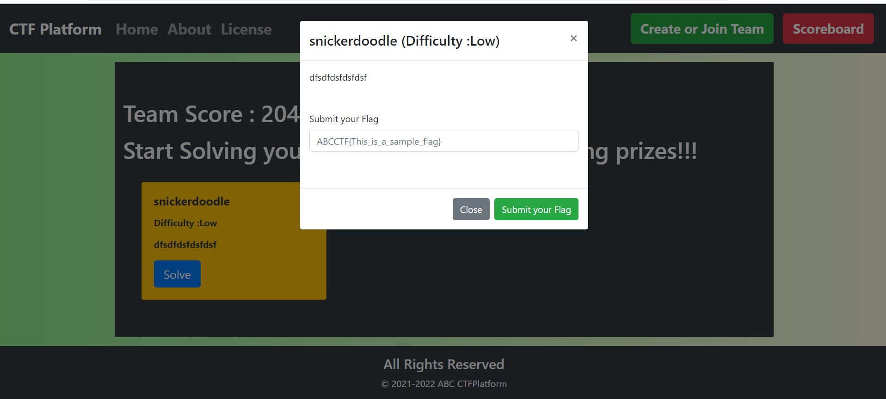

# CTF Platform 

A Simple Web Application to conduct small CTF Challenges which just require simple flags submission

## Features

1. Shows timer on the home page and shows all details about the organizers
2. Create new teams and do not allow the creation of a new team if the team already exists.
3. Scoreboard displays the current position of all the participants and their scores
4. Shows alerts and hints for unsolved challenges

## Technologies used

1. React JS 
2. Bootstrap Library
3. Django 
4. Django Rest Framework
5. React Router Dom 

## How to run this on your system?

Make sure you have installed Python and Node JS on your system

1. Install Dependencies

~~~
pip install django 
pip install djangorestframework
yarn install
~~~

2. Open a new terminal and write the commands as shown:

~~~
cd CTFPlatformBackend
python manage.py makemigrations
python manage.py migrate
python manage.py runserver
~~~
This will start backend server at
127.0.0.1:8000

3. Open a new terminal and write the commands as shown : 

~~~
cd ctfplatformfrontend
yarn install
yarn start
~~~

This will start frontend application at 127.0.0.1:3000

Make sure backend and frontend run simultaneously for this application to work properly.

## Screenshots

1. Home Page

2. About Page

3. License Page

4. Login Page

5. Team Register Page

6. ScoreBoard

7. Solve Challenges Page

## Bug Fixing and Contribution

Since this project is in its alpha stage, some bugs might have crept in. If you find any such bugs you can report them.

I welcome any sort of open source contributions.